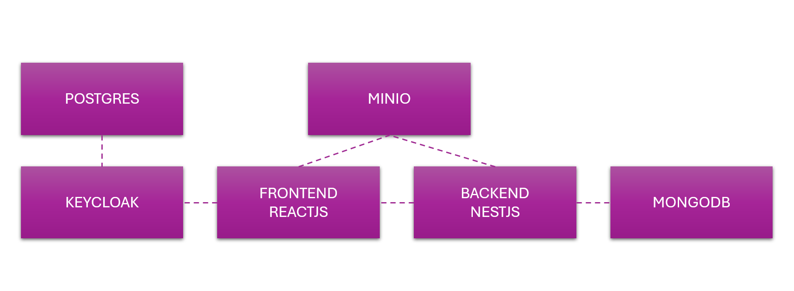

# Audio Storage & Playback Application

This application provides a complete solution for users to upload audio files to a server and play them back through a web interface. The system is containerized using Docker Compose for easy deployment and consists of multiple components working together.

## System Architecture

The application consists of several key components:

1. **Frontend**: React-based web application for user interaction
2. **Backend**: API service that handles business logic and integration
3. **Keycloak**: Authentication and authorization server
4. **MinIO**: Object storage for audio files
5. **MongoDB**: Database for storing audio metadata
6. **PostgreSQL**: Database for Keycloak

## Prerequisites

- Docker and Docker Compose
- Git

## Quick Start

```bash
# Clone the repository
git clone https://github.com/larrytanjj/audio-file-hosting.git
cd audio-file-hosting

# Start all services
docker-compose up -d
```

Once all containers are running, you can access the application at http://localhost:3000

## System Architecture


# 🎵 File Upload API

This API allows users to upload, list, and delete audio files. Each endpoint requires JWT-based authentication.

## Base URL

```
/file
```

---

## 🔐 Authentication

All endpoints require a valid JWT token passed in the `Authorization` header:

```
Authorization: Bearer <token>
```

---

## 📥 Upload Audio File
**POST** `/file/upload`
Uploads an audio file with additional metadata.
### Headers
```
Authorization: Bearer <JWT_TOKEN>
Content-Type: multipart/form-data
```
### Form Data
| Field        | Type   | Description             |
|--------------|--------|-------------------------|
| `file`       | file   | Audio file to upload    |
| `title`      | string | Title of the file       |
| `description`| string | Description (optional)  |
| `category`   | string | File category (e.g., podcast, music) |
### Example
```bash
curl -X POST http://localhost:5000/file/upload \
  -H "Authorization: Bearer <JWT_TOKEN>" \
  -F "file=@sample.mp3" \
  -F "title=My Audio" \
  -F "description=A short test" \
  -F "category=music"
```

---
## 📄 Get Uploaded Files
**GET** `/file/`
Retrieves a list of uploaded audio files for the authenticated user.
### Headers
```
Authorization: Bearer <JWT_TOKEN>
```
### Response
Returns an array of file metadata.
---

## ❌ Delete Audio File
**DELETE** `/file/:id`
Deletes a specific audio file belonging to the authenticated user.
### URL Parameters
| Param | Description      |
|-------|------------------|
| `id`  | ID of the file to delete |
### Headers
```
Authorization: Bearer <JWT_TOKEN>
```
### Example
```bash
curl -X DELETE http://localhost:5000/file/abc123 \
  -H "Authorization: Bearer <JWT_TOKEN>"
```

## Component Access Information

### Frontend Application
- **URL**: http://localhost:3000
- **Default User**: htx-demo
- **Password**: password

### Keycloak (Authentication Server)
- **URL**: http://localhost:8080
- **Admin User**: admin
- **Admin Password**: admin
- **Features**: User management, role-based access control, SSO

### MinIO (Object Storage)
- **URL**: http://localhost:9000
- **Console URL**: http://localhost:9001
- **Access Key**: minio_access_key
- **Secret Key**: minio_secret_key
- **Default Bucket**: audio (automatically created)

### MongoDB (Metadata Database)
- **URL**: mongodb://localhost:27017
- **Database**: audio_db
- **Collection**: audio
- **Note**: Running without authentication for development purposes

### PostgreSQL (Keycloak Database)
- **Port**: 5432
- **Database**: keycloak
- **User**: keycloak
- **Password**: password

## Component Details

### Frontend
The frontend is a React-based web application that provides:
- User authentication through Keycloak
- Audio file upload interface
- Audio playback functionality
- Audio file management

### Backend API
The backend API provides:
- REST endpoints for audio management
- Integration with MinIO for file storage
- Integration with MongoDB for metadata storage
- Authentication via Keycloak

### Keycloak
Keycloak provides:
- User authentication and authorization
- User management
- Single Sign-On (SSO)
- OAuth 2.0 and OpenID Connect support
- Custom realm configuration (loaded from realm-export.json)

### MinIO
MinIO provides:
- S3-compatible object storage
- Scalable and reliable storage for audio files
- Web-based console for storage management
- Anonymous download access to the audio bucket

### MongoDB
MongoDB stores:
- Audio file metadata
- User preferences
- Application data
- The audio collection is automatically created during initialization

## Development

To modify or extend the application:

1. Frontend code is located in `./frontend/audio-web-application`
2. Backend code is located in `./backend/audio-backend`
3. Keycloak realm configuration is in `./realm-export.json`

## Stopping the Application

```bash
docker-compose down
```

To remove all data volumes:
```bash
docker-compose down -v
```

## Security Notes

This setup is configured for development purposes:
- Keycloak is running in development mode
- MongoDB has no authentication enabled
- Passwords are set in plain text in the docker-compose file